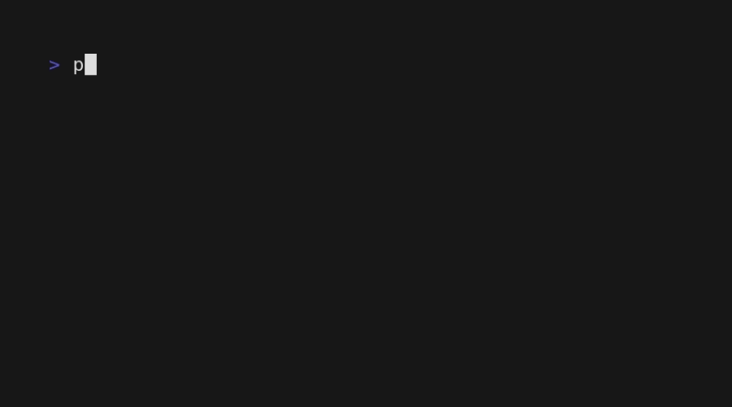
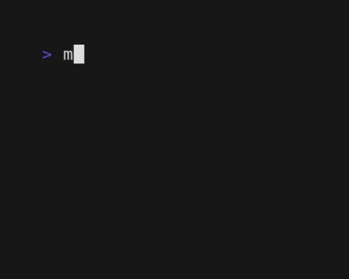

# 🗓️ mdtt: Markdown Table Editor TUI


Editing markdown tables can be a drag. `mdtt` makes it easier with a slick TUI for terminal use and vim-style keybindings. It supports output to stdout and in-place file editing.

## 📦 Installation

To install `mdtt` using Go, run:

```sh
go install github.com/szktkfm/mdtt@latest
```

Or, download it:

[GitHub Releases](https://github.com/szktkfm/mdtt/releases)

## 🎬 Usage

To start editing your markdown table, simply run:

```sh
mdtt filename.md
```

Upon launching, `mdtt` will display the tables from your markdown file in a TUI.

While editing, you can utilize the following vim-like keybindings to navigate and modify your tables efficiently:

- Navigation: Use hjkl for left, down, up, and right movements.
- Editing: Press i to switch to insert mode and edit cell content, exit insert mode with esc or ctrl+c.
- Row and Column Manipulation:
  - Add a new row or colymn with `o`, `vo`.
  - Delete the current row or column with `dd`, `vd`.
  - Copy the current row or column with `yy`, `vy`.
  - Paste a copied row or column with `p`.


For direct editing and saving changes to the same file, use:

```sh
mdtt -i filename.md
```


You can use piping with `mdtt` as shown below:

```sh
pbpaste | mdtt | pbcopy
```



To create a new table without an existing file, run `mdtt` without any arguments:

```sh
mdtt
```



When multiple tables are present, you will be prompted to select the table you wish to edit.


## ⌨️ Key Bindings

| Key            | Action            |
| -------------- | ----------------- |
| `↑`/`k`        | Move up           |
| `↓`/`j`        | Move down         |
| `←`/`h`        | Move left         |
| `b`/`pgup`     | Page up           |
| `f`/`pgdn`     | Page down         |
| `ctrl+u`       | Half page up      |
| `ctrl+d`       | Half page down    |
| `g`/`home`     | Go to start       |
| `G`/`end`      | Go to end         |
| `i`            | Insert mode       |
| `esc`/`ctrl+c` | Normal mode       |
| `o`/`vo`       | Add row/column    |
| `dd`/`vd`      | Delete row/column |
| `yy`/`vy`      | Copy row/column   |
| `p`            | Paste             |
| `q`            | Quit              |
| `?`            | Toggle help       |

## 📝 Features

- [x] **Vim-like Keybindings**: Navigate and edit tables using familiar vim commands.
- [x] **Inplace Editing**: Directly modify your original markdown files with the -i option.
- [x] **Piping Support**
- [x] **Multi-Table Selection**
- [ ] **HTML in Cells**: Enable rich content formatting by using HTML directly within table cells.

## 🙏 Acknowledgments

This project, `mdtt`, was inspired by [mdvtbl](https://github.com/karino2/mdvtbl), a tool that reads markdown from stdin, allows for table editing in a web view, and outputs to stdout.

## License

[MIT](./LICENSE)
